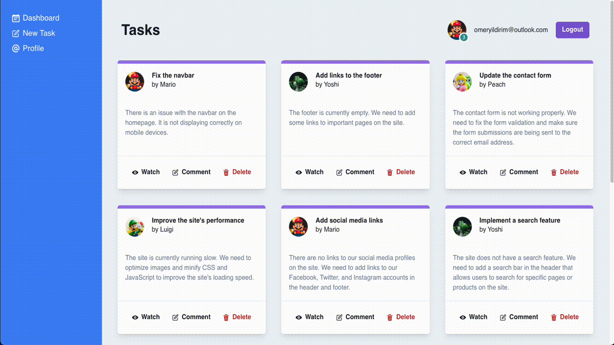

# Chakra-UI-Project
## Description

This is a Chakra UI crash course project. In this project, I have created a simple tasks website using Chakra UI.

## Tools and Technologies

React, Router, React Context API and Chakra-UI(Layout, Form, Feedback, Media and Icons, Toast, Typography),

## Expected Outcome

**

**

**
&#9786; Happy Coding &#9997;
**